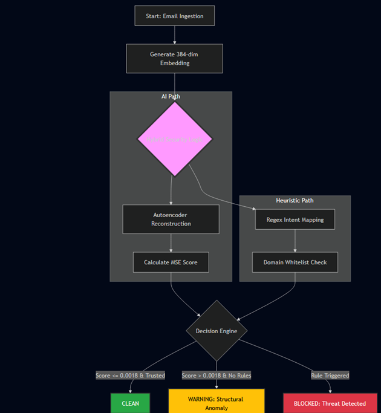

# Morpheus Guard: Unsupervised Spear Phishing Detection

Morpheus Guard is an AI-driven email security system that detects spear phishing attacks without requiring labeled attack data. Instead of matching known signatures, it learns the semantic fingerprint of legitimate business communication and flags any email that deviates meaningfully from that baseline — enabling zero-day detection.

## How It Works

The pipeline runs in three stages: **embedding → anomaly scoring → hybrid decision**.

Each email is converted into a 384-dimensional dense vector using SentenceTransformers (all-MiniLM-L6-v2). A deep autoencoder (384→128→64→32→64→128→384), trained exclusively on 370K legitimate Enron emails, attempts to reconstruct that vector. Emails the model has never seen — structurally abnormal emails — produce high reconstruction error (MSE). The detection threshold was set at the 80th percentile of validation error, the point where recall (56.1%) and false positive rate (13.7%) reach their optimal operational balance.

The AI layer alone has a known blind spot: attackers who mimic corporate language can suppress their anomaly score. Red-teaming confirmed this — a credential theft email scored 0.001523 and passed as clean. The fix is a second layer: a context-aware heuristic engine that applies regex pattern matching and domain whitelisting in parallel with the AI. Rules catch intent; AI catches structure. Neither is sufficient alone.

The final decision is three-tiered: Clean (score ≤ 0.0018 or trusted domain), Warning (structural anomaly), or Blocked (explicit rule trigger). Emails first pass through a CPU-managed queue for DoS rate-limiting before reaching the GPU inference stage.



## Data Pipeline

The training data was sourced from two corpora: the Enron Email Dataset (513,547 legitimate business emails) and a multi-source phishing dataset (18,041 malicious emails), producing a 28:1 class imbalance that mathematically justifies the unsupervised approach — labeled attack data is simply too scarce to train a reliable classifier.

Cleaning was non-trivial at this scale. SMTP headers were stripped, HTML/CSS tags removed via regex, and length boundaries enforced (10 < length ≤ 30,000 characters) to eliminate empty shells and multi-megabyte Base64 attachment blobs that would crash Transformer memory. EDA revealed extreme outliers exceeding 1,000,000 characters in the raw corpus. URLs were defanged (http → hxxp) to prevent accidental execution during analysis. Memory was managed explicitly with `dtype=str` and `fillna('')` across 500K+ row DataFrames to prevent spikes during processing.

The cleaned data was split into three sets: 369,753 normal emails for training, 41,084 normal emails for validation, and 120,751 mixed emails (normal + all phishing) for testing. The training and validation sets are 100% clean — the model never sees an attack during learning.

## EDA Findings

Phishing emails average 1,701 characters versus 1,456 for legitimate Enron email — attackers need more text to embed social engineering. Word cloud analysis confirmed a clear semantic split: Enron vocabulary is dominated by scheduling, project, and corporate terms; phishing vocabulary by urgency markers, financial terms, and action-oriented keywords.

A baseline TF-IDF (5,000 features) + Isolation Forest model was tested first and scored 85% overall accuracy — but caught exactly 0 out of 18,041 phishing emails. This accuracy trap confirmed that traditional ML cannot detect phishing that mimics business language and justified the shift to deep learning.

## Model Training

The autoencoder was trained on an NVIDIA T4 GPU (16GB VRAM) using the Adam optimizer (lr=1e-3, batch size 512) for 20 epochs. Loss function is MSE — the same metric used at inference for anomaly scoring. Validation loss tracked training loss throughout with no meaningful divergence, confirming the model generalised rather than memorised:

| Epoch | Train Loss | Val Loss |
|---|---|---|
| 1 | 0.001516 | 0.001262 |
| 5 | 0.001126 | 0.001128 |
| 10 | 0.001097 | 0.001100 |
| 15 | 0.001075 | 0.001080 |
| 20 | 0.001062 | 0.001064 |

Threshold selection was driven by the recall/FPR tradeoff across percentiles:

| Percentile | Recall | FPR |
|---|---|---|
| 95th | 22.3% | 2.0% |
| 90th | 28.8% | 4.0% |
| 85th | 38.9% | 8.1% |
| **80th** | **56.1%** | **13.7%** |
| 75th | 61.5% | 17.2% |
| 70th | 67.2% | 23.5% |

The 80th percentile was chosen as the operational sweet spot — below it the false positive rate becomes too disruptive to business continuity, above it detection drops sharply.

## Technical Stack

- **Embeddings**: SentenceTransformers all-MiniLM-L6-v2 (384-dim vectors, batch size 256)
- **Model**: PyTorch deep autoencoder, Adam optimizer, trained on 369,753 normal emails
- **Hybrid Layer**: Regex heuristic engine + domain whitelisting
- **Interface**: Gradio web dashboard with real-time anomaly score and logging display
- **Explainability**: Token ablation + UMAP cluster visualization
- **Compute**: Google Colab, NVIDIA T4 GPU (16GB VRAM)

## Explainability (xAI)

Two explainability mechanisms were implemented to make the system auditable by security analysts.

**Token ablation** identifies which specific words drive an email's anomaly score by removing them one at a time and measuring the score delta. Testing on the email "URGENT: Please verify your account" produced a baseline score of 0.001431. Removing "account" raised the score to 0.001769 — confirming it as a core anomaly driver. Removing "Please" dropped the score to 0.001298 — revealing that polite language actively suppresses the anomaly signal and acts as adversarial camouflage. This finding directly informed the heuristic rules layer design.

**UMAP visualization** projects the 384-dimensional embedding space into 2D and shows a clear physical separation between the dense cluster of normal Enron emails and phishing outliers. This confirms the autoencoder's ability to distinguish semantic structure, even when vocabulary overlaps.

## Hybrid Pipeline

The heuristic engine runs in parallel with the AI and overrides it when an explicit threat artifact is found. Rules implemented:

- **Phishing**: matches `(urgent|immediately|verify).*(http|www)` combined with an untrusted domain check
- **Malware**: matches executable extensions `\.(exe|bat|vbs|js|scr)`
- **MITM/Financial fraud**: matches `(offshore|cayman|crypto)` for suspicious routing language

Trusted domain whitelist (bypasses AI flagging): zoom.us, microsoft.com, sharepoint.com, nvidia.com, google.com, hit.ac.il.

Decision priority: rule triggers win over AI score, which wins over baseline clean.

## Security Testing

Adversarial scenarios tested against the final hybrid pipeline:

| Attack Type | AI Score | AI Result | Hybrid Result |
|---|---|---|---|
| Normal business email | 0.00098 | Clean | Clean |
| Credential phishing (business jargon) | 0.00152 | Clean (fail) | Blocked — rule intercept |
| MITM offshore account change | 0.00153 | Clean (fail) | Blocked — financial sensor |
| Malware attachment (.exe/.zip) | 0.00109 | Clean (fail) | Blocked — attachment rule |
| DoS text bomb (70K chars) | 0.00205 | Blocked | Blocked — AI detection |
| Typosquatting / character noise | — | Blocked | Blocked — structural deviation |

The AI-only failures against the first three attacks are what motivated the hybrid architecture. The DoS test processed 70,000 characters in 0.047 seconds without crashing — the GPU inference stage is resilient to payload flooding.

## Dashboard

The Gradio web UI accepts raw email text and returns a verdict with anomaly score and timestamped log entry. The three verdict states map directly to the decision tiers: ✅ Clean, ⚠️ Warning (structural anomaly), 🚩 Blocked (rule triggered). The logging module records the AI score, the layer that triggered the decision (AI Autoencoder, Hybrid Heuristics, or None), and the timestamp — giving analysts a full audit trail per scanned email.

The system also exposes a JSON API endpoint that accepts `{sender, subject, body}` and returns the verdict, MSE score, threat reasons, and the security layer that triggered — designed for integration with external email gateway infrastructure.

## Retrospective

The core limitation is dataset composition. Training on an overwhelming majority of standard corporate email taught the autoencoder that business terminology is a normality signal. Attackers who exploit that assumption can evade the AI layer. A corrected approach would cap and diversify the benign training set to prevent vocabulary from dominating the reconstruction signal, forcing the model to learn structural patterns rather than lexical ones. The hybrid layer compensates for this at runtime, but the fix should be upstream.

## Running the System

```bash
pip install torch gradio sentence-transformers pandas
```

Open `Project/7 & 8. Prototype Development (MVP) and Performance and Effectiveness Evaluation/Performance_and_Evaluation.ipynb`, run all cells to load `spear_phishing_ae_weights.pth`, and access the Gradio dashboard for live inference.
